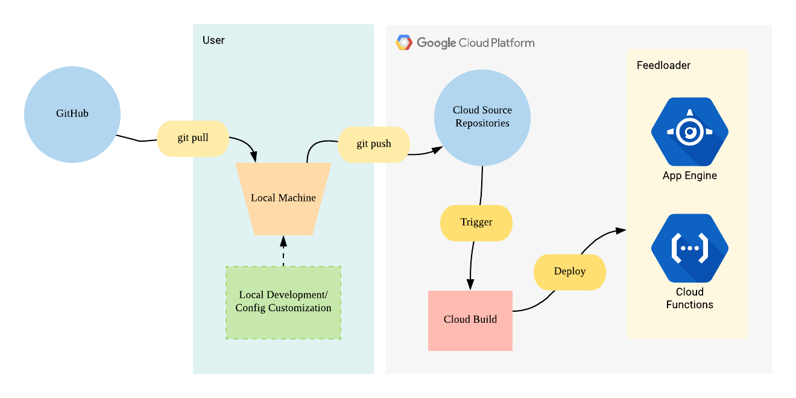

# FeedLoader

_Copyright 2019 Google LLC. This solution, including any related sample code or
data, is made available on an “as is,” “as available,” and “with all faults”
basis, solely for illustrative purposes, and without warranty or representation
of any kind. This solution is experimental, unsupported and provided solely for
your convenience. Your use of it is subject to your agreements with Google, as
applicable, and may constitute a beta feature as defined under those agreements.
To the extent that you make any data available to Google in connection with your
use of the solution, you represent and warrant that you have all necessary and
appropriate rights, consents and permissions to permit Google to use and process
that data. By using any portion of this solution, you acknowledge, assume and
accept all risks, known and unknown, associated with its usage, including with
respect to your deployment of any portion of this solution in your systems, or
usage in connection with your business, if at all._

[TOC]

## Introduction

### What does it do?

Feedloader is a packaged solution for Google Cloud that automates ingestion of
Google Merchant Center ("GMC") Shopping feeds, and sends the data to GMC via a
Content API interface at minimal cost and maximal performance.

Feedloader also features automatic prevention of product expiration in GMC,
along with logging, alerts, and potential for user-contributed optimization
expansions.

### Who is it for?

Users of GMC that have a Multi-Client Account ("MCA") or sub-accounts with
Merchant Center IDs and feed files (CSV/TSV format) of their products can
leverage Feedloader to automate Shopping data uploads at scale.

### What does it cost?

The only costs required to operate Feedloader are those to run the GCP
environment's components, which are listed below. **Cost to run Feedloader will
vary depending on usage frequency and volume of data processed**.

Individual product pricing can be found on their respective pricing pages, but
we have taken precautions and design considerations to reduce GCP usage cost as
much as possible, as many of the services fall under the free-tier usage limit
for most use cases of Feedloader.

-   App Engine (https://cloud.google.com/appengine/pricing)
-   BigQuery (https://cloud.google.com/bigquery/pricing)
-   Cloud Build (https://cloud.google.com/cloud-build/pricing)
-   Cloud Composer (https://cloud.google.com/composer/pricing)
-   Cloud Functions (https://cloud.google.com/functions/pricing)
-   Cloud Run (https://cloud.google.com/run/pricing)
-   Cloud Source Repositories
    (https://cloud.google.com/source-repositories/pricing)
-   Cloud Storage (https://cloud.google.com/storage/pricing)
-   Cloud Tasks (https://cloud.google.com/tasks/docs/pricing)
-   Key Management Service (https://cloud.google.com/kms/pricing)
-   PubSub (https://cloud.google.com/pubsub/pricing)
-   Stackdriver (https://cloud.google.com/stackdriver/pricing)

## Prerequisites

-   [Install the Google Cloud SDK](https://cloud.google.com/sdk/) to be able to
    run CLI commands. Ensure both alpha and beta are installed, and update
    components to the latest versions:

    -   `gcloud components install alpha`

    -   `gcloud components install beta`

    -   `gcloud components update`

-   [Install Python version 3 or greater](https://www.python.org/downloads/).

    -   Then install the following packages:

        `pip3 install google-auth requests`

-   Have a Google Cloud Project available, or
    [create a new one](https://cloud.google.com/resource-manager/docs/creating-managing-projects).

    -   If a billing account has not been set on the project, set one by
        [following these instructions](https://cloud.google.com/billing/docs/how-to/modify-project).

    -   Create a Stackdriver Workspace for the project by
        [following the steps here](https://cloud.google.com/monitoring/workspaces/guide#create-quickly).

-   Clone the code from this repository.

## Configuration

-   Move to the root directory of the project and open the file
    `feed_schema_config.json`. Customize the mapping by naming the `csvHeader`
    fields to match your feed file’s schema/headers.

    -   The fields for 'bqColumn' should not be changed, but if your feed has
        Content API fields that are not in the default json schema, additional
        fields can be added. Refer to the full Content API product spec
        [here](https://developers.google.com/shopping-content/v2/reference/v2/products#resource-representations).

    -   Ensure that the naming and order matches your feed file’s headers
        **exactly**, or the resulting data in GMC will be corrupted.

    -   If your feeds specify different GMC IDs per-item, append the following
        column entry for the GMC ID, and ensure your feed contains the header
        `google_merchant_id` for these IDs:

        `{"csvHeader": "google_merchant_id", "bqColumn": "google_merchant_id",
        "columnType": "INTEGER"}`

-   Edit the env.sh file in the repository root directory and supply values for
    all of the variables.

    -   For the variables ending in "BUCKET", follow the
        [naming conventions](https://cloud.google.com/storage/docs/naming) for
        Google Cloud Storage buckets or they will not be created properly.

## Installation

-   Run the initialization script in the root directory:

    `bash initialize_project.sh`

    -   **Due to dependencies on Cloud Composer environment initialization, the
        installation could take a long time (~45 minutes).**

    -   If the scripts hangs (no log output for > 30 minutes), try using Ctrl-C
        to kill it. It might unblock it (if something was hanging) or kill it.
        If it gets killed, you can re-run it safely as the script is written to
        be re-runnable without harm.

    -   Check the logs of the script for any errors.

-   Add the service account created in the script to GMC by following these
    steps:

    -   Navigate to your GMC UI.

    -   Go to User access for GMC (section: “Invite a new user”).

    -   Add the Service account’s email address (replace [PROJECT_ID] with your
        GCP project ID):

        merchant-center@[PROJECT_ID].iam.gserviceaccount.com

-   In order to deploy the Feedloader solution to your GCP project, it is
    required to perform a git push to your GCP project's Cloud Source Repository
    (reference:
    [Cloud Source Repositories](https://cloud.google.com/source-repositories/docs/pushing-code-from-a-repository)).
    Cloud Build will auto-trigger on the git push and deploy the code to GCP.

    -   Generate a new identifier for Cloud Source Repositories by running the
        command shown on https://source.developers.google.com/new-password
    -   Run the following git commands in the same local repository you cloned
        and ran the initialization script in:

        1.  `git remote add google
            ssh://[EMAIL]@source.developers.google.com:2022/p/[PROJECT_ID]/r/[REPO_NAME]`
            (Where `PROJECT_ID` is your GCP project ID and `REPO_NAME` is the
            repository name you set for `SOURCE_REPO` in env.sh)
        2.  `git add -A`
        3.  `git status`
        4.  Ensure no service_account .json files are being added, just the .enc
            files and a variables.json file.
        5.  `git commit -m "[Your commit message]"`
        6.  `git push --all google` (If you see a prompt for choosing a
            configuration, choose option 1)

    -   This will trigger the build scripts installed in your GCP project to
        deploy all the code and necessary resources. It should take around 2
        minutes. [You can check the status in your GCP Console's Cloud Build
        dashboard or history
        tab](https://cloud.google.com/cloud-build/docs/view-build-results#viewing_build_results).
        Ensure that the logs show no errors.

-   Feedloader should now be ready to use.

## Usage

-   Set the following environment variables in your shell:

    -   `GCP_PROJECT`: The ID of your GCP project.

    -   `FEED_PATH`: Set this to the directory where your feed data files
        reside. **They must be in CSV or TSV format**. It

        can be a relative path, absolute path, or ~ path, but do not use double
        quotes if you use a ~ in the path.

    -   `FEED_BUCKET`: The GCP Storage Bucket to upload feed files to, e.g.
        “gs://shopping-feed-bucket”.

    -   `UPDATE_BUCKET`: The GCP Storage Bucket to upload the EOF file to, e.g.
        “gs://update-bucket”.

-   Login to GCP with gcloud and set your current project:

    `gcloud auth login`

    `gcloud config set project $GCP_PROJECT`

-   Upload your feed files to GCP Cloud Storage using this command:

    `gsutil cp -j csv $FEED_PATH/* $FEED_BUCKET`

-   **Wait until all feed files are uploaded.** Depending on the number and size
    of the files, this may take several minutes to fully load into BigQuery. We
    recommend to wait approximately 5 minutes for a batch of 100 files at
    ~50,000 products per file.

-   Prepare an empty zero-byte file named “EOF” (do not put it in the same
    folder as the feed files) and upload it to the UPDATE_BUCKET GCS bucket:

    `touch ~/[PATH_TO_EOF]/EOF`

    `gsutil cp [PATH_TO_EOF]/EOF $UPDATE_BUCKET`

-   Feedloader will process items that require changes in Content API (new
    items, updated items, deleted items, and items about to expire), and send
    them to GMC. You can view the results in your GMC UI.

## Optimizations

Before Feedloader sends product data to Content API, it has the option to
interface with a "Shoptimizer" REST API (also packaged in Feedloader within this
repository) hosted in a Docker container that includes various optimization
logic which attempts to automatically "fix" the data based on Google Shopping
best practices.

Not only can this API be used standalone (for users that already have a Content
API interface), but these optimizations can also be extended with custom user
implementations relatively easily if so desired.

## Testing

Feedloader comes packaged with suites of unit tests, API integration tests, and
end-to-end tests.

### Unit Tests

Some unit tests are currently run as part of the build process. i.e., the code
will not deploy unless the tests all pass in Cloud Build. These include the
Shoptimizer API unit tests.

Other tests will need to be run manually via Ava (for Cloud Functions) and the
packaged test runners for Python App Engine code.

### Integration Tests (Shoptimizer API only)

Feedloader includes a Postman collection that can be used to send mock requests
to the Shoptimizer API. The collection also has built-in tests that can be run
all at once to verify the API code. The environments can be set to point to your
GCP Cloud Run endpoints to run against the currently-deployed containerized API.
A token is necessary to supply to the requests, and can be specified in the
Postman environment settings. To retrieve this token, use
[this CLI command](https://cloud.google.com/sdk/gcloud/reference/auth/print-identity-token)
for your GCP project.

### End-To-End Tests

Feedloader comes packaged with several bash test scripts that kick off actual
data uploads and EOF triggers to run the solution automatically for various use
cases, and each time the scripts are run, GCP resources are force-cleaned so
that they can be run again and again.

## Syncing your deployment with future Feedloader releases

This repository may be updated with new releases. To get the newly released code
deployed to your GCP environment, simply perform a git pull from this
repository, then a git add, commit, and push into your Cloud Source Repository.
Refer to the diagram below for an overview.

If infrastructure or environment changes are required (i.e. not solely
code-based changes), then documentation will be provided on how to update for
that release.

